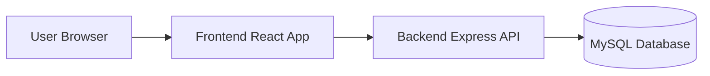
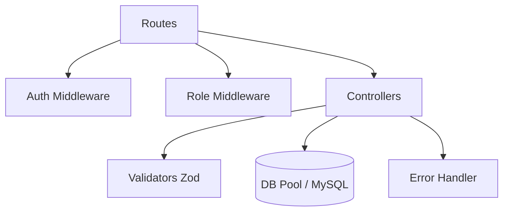
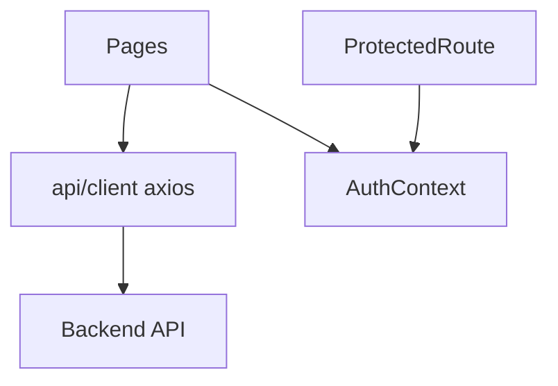
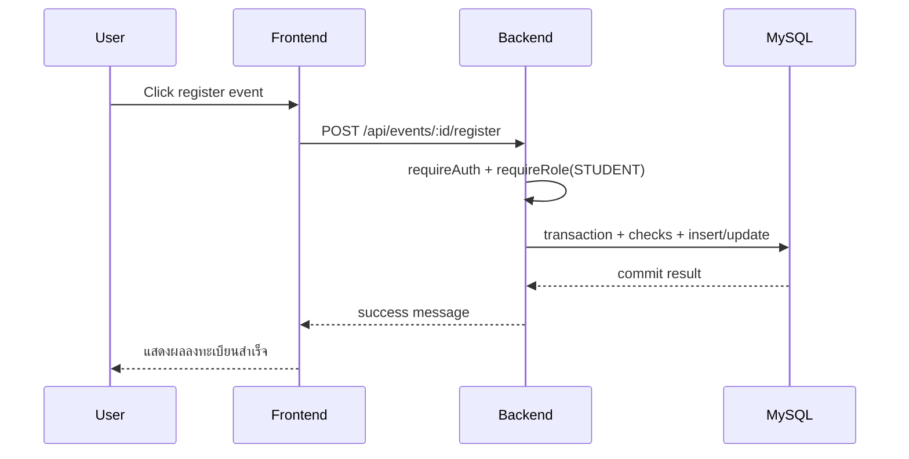

# D2 Component Diagrams

## 1) High-level Components

```mermaid
flowchart LR
  U[User Browser] --> F[Frontend React App]
  F --> A[Backend Express API]
  A --> D[(MySQL Database)]
```

## 2) Backend Internal Components

```mermaid
flowchart TD
  R[Routes] --> M1[Auth Middleware]
  R --> M2[Role Middleware]
  R --> C[Controllers]
  C --> V[Validators Zod]
  C --> DB[(DB Pool / MySQL)]
  C --> EH[Error Handler]
```

## 3) Frontend Internal Components

```mermaid
flowchart TD
  P[Pages]
  CTX[AuthContext]
  PR[ProtectedRoute]
  API[api/client axios]

  P --> API
  P --> CTX
  PR --> CTX
  API --> BE[Backend API]
```

## 4) Registration Sequence (Simplified)

```mermaid
sequenceDiagram
  participant User
  participant FE as Frontend
  participant BE as Backend
  participant DB as MySQL

  User->>FE: Click register event
  FE->>BE: POST /api/events/:id/register
  BE->>BE: requireAuth + requireRole(STUDENT)
  BE->>DB: transaction + checks + insert/update
  DB-->>BE: commit result
  BE-->>FE: success message
  FE-->>User: แสดงผลลงทะเบียนสำเร็จ
```
